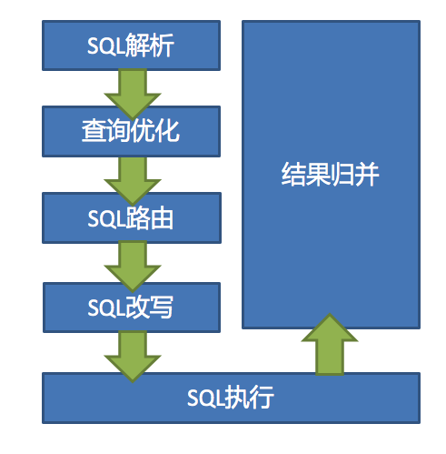

分布式文件系统FastDFS
分布式调度解决方案Elastic-Job
###分表:
   #### 垂直拆分：
        垂直拆分表就是专表专用，只是将数据库压力分散到其他数据库。
  #### 水平拆分：
        水平分片又称为横向拆分。 相对于垂直分片，它不再将数据根据业务逻辑分类，而是通过某个字段（或某几个字段），
        根据某种规则将数据分散至多个库或表中，每个分片仅包含数据的一部分。
        例如：根据主键分片，偶数主键的记录放入0库（或表），奇数主键的记录放入1库（或表）
    
    
###分片
   ####分片键
    用于分片的数据库字段，是将数据库(表)水平拆分的关键字段。例：将订单表中的订单主键的尾数取模分片，则订单主键为分片字段。
     SQL中如果无分片字段，将执行全路由，性能较差。 除了对单分片字段的支持，ShardingSphere也支持根据多个字段进行分片。
   ####分片算法
   #####精确分片算法
    对应PreciseShardingAlgorithm，用于处理使用单一键作为分片键的=与IN进行分片的场景。需要配合StandardShardingStrategy使用。
   #####范围分片算法
    对应RangeShardingAlgorithm，用于处理使用单一键作为分片键的BETWEEN AND、>、<、>=、<=进行分片的场景。需要配合StandardShardingStrategy使用。
   #####复合分片算法
    对应ComplexKeysShardingAlgorithm，用于处理使用多键作为分片键进行分片的场景，包含多个分片键的逻辑较复杂，
    需要应用开发者自行处理其中的复杂度。需要配合ComplexShardingStrategy使用。
   #####Hint分片算法
    对应HintShardingAlgorithm，用于处理使用Hint行分片的场景。需要配合HintShardingStrategy使用。
   ####分片策略
    包含分片键和分片算法，由于分片算法的独立性，将其独立抽离。真正可用于分片操作的是分片键 + 分片算法，也就是分片策略。目前提供5种分片策略。
   #####标准分片策略
    对应StandardShardingStrategy。提供对SQL语句中的=, >, <, >=, <=, IN和BETWEEN AND的分片操作支持。StandardShardingStrategy只支持单分片键，提供PreciseShardingAlgorithm和RangeShardingAlgorithm两个分片算法。PreciseShardingAlgorithm是必选的，用于处理=和IN的分片。RangeShardingAlgorithm是可选的，用于处理BETWEEN AND, >, <, >=, <=分片，如果不配置RangeShardingAlgorithm，SQL中的BETWEEN AND将按照全库路由处理。
   #####复合分片策略
    对应ComplexShardingStrategy。复合分片策略。提供对SQL语句中的=, >, <, >=, <=, IN和BETWEEN AND的分片操作支持。ComplexShardingStrategy支持多分片键，由于多分片键之间的关系复杂，因此并未进行过多的封装，而是直接将分片键值组合以及分片操作符透传至分片算法，完全由应用开发者实现，提供最大的灵活度。
   #####行表达式分片策略
    对应InlineShardingStrategy。使用Groovy的表达式，提供对SQL语句中的=和IN的分片操作支持，只支持单分片键。对于简单的分片算法，可以通过简单的配置使用，从而避免繁琐的Java代码开发，如: t_user_$->{u_id % 8} 表示t_user表根据u_id模8，而分成8张表，表名称为t_user_0到t_user_7。
   #####Hint分片策略
    对应HintShardingStrategy。通过Hint指定分片值而非从SQL中提取分片值的方式进行分片的策略。
   #####不分片策略
    对应NoneShardingStrategy。不分片的策略。
    
###内核解析

   